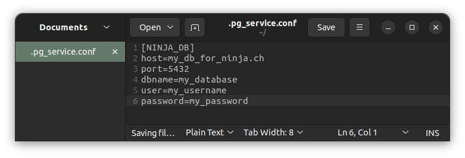

# PostgreSQL service

A `pg_service.conf` file allows to use an named alias for a PostgreSQL server connection. Instead of storing hostname, port, database name and more into the QGIS Project file, these can be stored separately. It is even possible to store username and password in a `pg_service.conf` file, to avoid having this stored in clear text in the QGIS Project.

Read more about PostgreSQL services in the [QGIS documentation](https://docs.qgis.org/3.22/en/docs/user_manual/managing_data_source/opening_data.html#postgresql-service-connection-file).

# QField - Direct Connection

If you directly connect from QGIS to your database you can make use of a `pg_service.conf` file by placing it in the QField data folder. You can place your file either on the Internal Device Storage or on the SD Card Storage. You can check the path for the QField data folder in the bottom of the `About QField` screen in the app.

Usually the path on Android devices looks something like this: `/Android/data/ch.opengis.qfield/files/QField`.

!!! note
    Unlike on *NIX systems where the file is named `.pg_service.conf`, the file on Android is named `pg_service.conf` without a leading dot sign (`.`).

# QFieldCloud

QFieldCloud support `pg_service.conf` configurations too. You need to configure your PostgreSQL layers with "Offline editing" cloud action and store your service settings on QFieldCloud Project's Secrets page.

Read more [how to configure PostgreSQL service](../reference/qfieldcloud/secrets.md) in the QFieldCloud documentation.

## Creating a `pg_service.conf` File for PostgreSQL Connection in QGIS and Secrets

Before beginning, ensure that your PostgreSQL database allows connections from QFieldCloud. Refer to [Technical specs](../reference/qfieldcloud/specs.md) for instructions.

### Setup `pg_service.conf` File

We first need to set up a configuration file. There are many options to organize this, [read more in the PostgreSQL documentation](https://www.postgresql.org/docs/current/libpq-pgservice.html) or follow the description below.

1. **Create a Configuration File**:

   - On Windows:
     Create a file named `pg_service.conf` and store it in a convenient location.

   - On Linux/MacOS/Unix:
     Create a file named `.pg_service.conf` in your home folder (`~`).

2. **Define Connection Parameters**:

   Within the file, specify connection parameters for your PostgreSQL database using the following format:

   ```plaintext
   [SERVICE_NAME]
   host=your_host_or_ip
   port=your_port
   dbname=your_database_name
   user=your_username
   password=your_password
   ```

   Replace placeholders (`your_host_or_ip`, `your_port`, `your_database_name`, `your_username`, `your_password`) with actual connection details and save the file.

!

### Additional Configuration Steps for Windows

1. **Set Environment Variable**:
   To ensure QGIS recognizes `pg_service.conf`, create an environment variable pointing to its location:

   - Navigate to "This PC" or "My Computer" > Properties > Advanced System Settings > Environment Variables.
   - Add a new variable:
     - Variable name: `PGSERVICEFILE`
     - Variable value: `C:\Users\<YourUsername>\AppData\Roaming\postgresql\pg_service.conf` (or your `pg_service.conf` file path).

   Alternatively, you can set environment variables directly in QGIS via Settings > Options > System > Environment. Refer to [QGIS System Settings](https://docs.qgis.org/3.28/en/docs/user_manual/introduction/qgis_configuration.html#system-settings) for details.

!

1. **Test the Connection in QGIS**: Open QGIS and set up a new PostgreSQL connection using the service name defined in `pg_service.conf` (e.g., `[MY_QGIS_DB]`) in the connection details. QGIS will read configuration from `pg_service.conf` automatically.

   - Open QGIS.
   - Go to "Layer" > "Add Layer" > "Add PostGIS Layers..."
   - In "Create a New PostGIS Connection," select "Service" from the drop-down menu.
   - Enter the service name from `pg_service.conf` (e.g., `[NINJA_DB]`) in the "Service" field.
   - Click "OK" to connect to your PostgreSQL database using configurations from `pg_service.conf`.

!

1. **Add Parameter to QFieldCloud Secrets**: Navigate to the project's secrets page and copy the service directly from `.pg_service.conf` to the secret. Follow [Secrets](../reference/qfieldcloud/secrets.md) for guidance.

!
